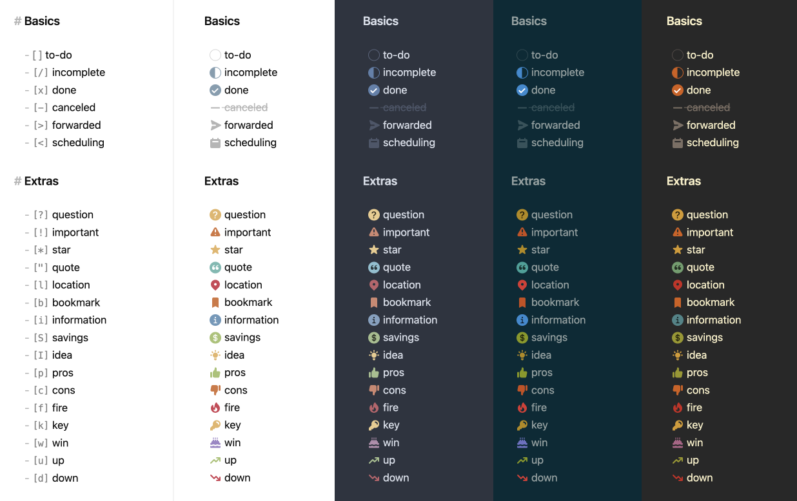

# FTAG_AQT_vault

- An [Obsidian](https://obsidian.md/) note backup repository.
- This repository serves as a backup for the FTAG_AQT Obsidian vault. It stores notes and configurations tracked with Git to enable version history and recovery.
- Main entrance for the notes: [Light-Jet Calibration on Dijet Samples](Light-Jet%20Calibration%20on%20Dijet%20Samples.md).

## Notes

- The `.obsidian/workspace.json` file is excluded from tracking as it contains per-device window state.
- Plugin data stored under `.obsidian/plugins/` is tracked to preserve plugin configurations.
- Tag #Question and #TODO are added to locate notes easier.
- checkbox styles from theme (refer to [minimal guide](https://minimal.guide/home)):

