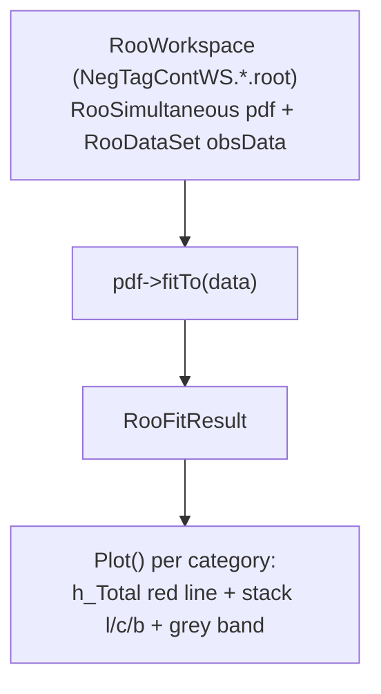

# 0001 — How Post-Fit Plots Are Built in DoFit

*Tracing the path from RooFit PDF to the stacked histogram you see on screen.*

**Mission:** [[MISSION]] · **Next:** [[0002-workspace-contents]] · **Glossary:** [[GLOSSARY]]

---

## The question

When DoFit produces a post-fit plot, what exactly is being drawn? Where do the pre-fit and post-fit distributions come from?

## The short answer

> [!info]
> The post-fit plot shows: data points, a post-fit stacked curve (l/c/b), a fit uncertainty band — and, since 2026-09-18, a pre-fit line. The pre-fit was attempted years ago via `GetTotalPrefit()` but was commented out because it gave wrong results. The root cause turned out to be an initialization bug, not the plotting machinery (see below).

## The data flow



1. `RooWorkspace` (`NegTagContWS.*.root`) holds `RooSimultaneous pdf` + `RooDataSet "obsData"`
2. `pdf->fitTo(data)` → `RooFitResult`
3. `Plot()` per category → `h_Total` (red line), stack (l/c/b fills), `g_Band_Norm` (grey band)

## Step by step

### 1. ModelTool captures a "pre-fit" total

When `ModelTool` is constructed (`ModelTool.cxx:157-161`), before any fit runs, it evaluates `GetTotal()` for each category and stores it in `h_Total_Prefit` — the PDF at *initial* parameter values.

### 2. Why the pre-fit was wrong (root cause, found 2026-09-18)

The old comment in `DoFit.cxx` blamed the `RooRealSumPdf` coefficients ("not initialized to the prefit integrals"). **That diagnosis was wrong.** Diagnostic on the real workspace (TagBin1, pre-fit values):

| flavor | coef (= model formula ✓) | raw MC template |
| ------ | ------------------------ | --------------- |
| light  | 199.4e9                  | 418.3e9         |
| charm  | **211.4e9**              | **26.7e9**      |
| b      | 17.7e9                   | 5.6e9           |

The coefficients faithfully evaluate the model formula — the formula's *inputs* were wrong. In `BuildWS.cxx`:

```cpp
// SampleNames = {"inc", "l", "c", "b"}  -- index 0 is "inc"!
const double f_c_MC = N_Pretag_Samples.at(1) / N_Inc_Pretag;  // BUG: at(1) = "l"
const double f_b_MC = N_Pretag_Samples.at(2) / N_Inc_Pretag;  // BUG: at(2) = "c"
```

`f_c` was initialized to the **light** fraction (≈0.92, silently clipped to its range max 0.5) and `f_b` to the **charm** fraction. The pre-fit model had 50% charm jets. Post-fit results were unaffected because `f_c`/`f_b` float in the fit.

**Fix:** use `at(2)`/`at(3)`. After the fix, all 18 (tag bin × flavor) coefficients match the raw MC template integrals to ~1e-5, and the pre-fit line (blue dashed) is enabled in `Plot()` and `PlotTagBin()`.

### 3. How the post-fit curve is built

After `pdf->fitTo()` converges, `Plot()` calls:

**Per-flavor histograms** — `tool->GetHistogram()` (`ModelTool.cxx:191-212`):
1. Clone the bin template for the category
2. For each bin, set the observable to the bin center
3. Read the flavor's shape function value
4. **Normalize to unit integral**
5. Scale by the **post-fit** coefficient

**Total** — `tool->GetTotal()` (`ModelTool.cxx:214-232`): sums the flavor histograms.
**Uncertainty band** — `tool->GetYieldTotalBin()` (`ModelTool.cxx:240-266`): PDF integral per bin + `getPropagatedError(FitRes)`.

### 4. The data points

From `DataSample->plotOn()` (`DoFit.cxx:1270`), with error bars **overwritten** (`DoFit.cxx:1283-1305`) by the SumW2 errors from the original TH1 in `gTemplateDataFile` — RooFit's `plotOn` on HistFactory datasets loses per-bin SumW2.

## What each plot element represents

| Element | Source | Parameters |
|---|---|---|
| Data points | `obsData` + SumW2 from `gTemplateDataFile` | observed |
| Stacked l/c/b | `GetHistogram()` — shape × post-fit coefficient | post-fit |
| Red line | `GetTotal()` — sum of components | post-fit |
| Grey band | `GetYieldTotalBin()` — integral + error propagation | post-fit ± σ |
| Blue dashed | `GetTotalPrefit()` — model at pre-fit values | pre-fit (= raw MC) |

## A real example

Actual plot: GN2v01 Flip, period ADE (163 fb⁻¹), 50–100 GeV, tightest tag bin (65–0% quantile):

![[example-msv-plot.png]]

The "no SV" bin is light-flavour dominated (grey) even in the tightest tag bin, while the SV-mass bins are b-jet dominated (blue) — that shape difference is exactly what the fit exploits.

The fixed version, with the pre-fit line (PtBin4, 100–150 GeV, all fits status 0):

![[example-prefit-fixed-plot.png]]

Blue dotted = pre-fit (raw MC), sitting ~20–30% above the fit result in the SV bins: the MC slightly over-tags and the fit pulls the flavor normalizations down onto the data. Red = fit result passes through the data points.

## Key insight

==The post-fit stacked plot is not a histogram readout — it's the RooFit PDF re-evaluated bin-by-bin at the post-fit parameter values.== Shape comes from the template functions, normalization from the post-fit coefficients. The pre-fit line uses the same machinery at pre-fit values — it is only correct if the initial parameter values are physically correct, which is why the flavor-fraction init bug mattered.

## Check your understanding

> [!question] If you were to add a correct pre-fit curve to the plot, what would you need to do differently from the broken `GetTotalPrefit()`?
> Answer from memory first, then unfold to check.
>
> > [!success]- Answer
> > Nothing — the machinery was fine. You need to fix what feeds it: the initial parameter values (the flavor-fraction init in BuildWS). Prefit = model at pre-fit parameters; with correct inits it equals the raw MC templates. The absolute normalization was never "missing" from the machinery — it was wrong in the inputs.

---

**Primary source:** `DoCalibration/src/DoFit.cxx` lines 1106–1488 (`Plot()`), `DoCalibration/src/ModelTool.cxx` lines 157–232. Background: [ROOT RooFit manual](https://root.cern/manual/roofit/).

*Ask follow-up questions to your agent — anything unclear, dig in together.*
