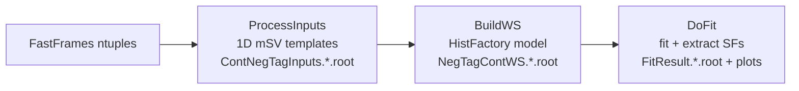

# 0002 — Inside NegTagContWS.root: The RooFit Workspace

*What BuildWS stores and how DoFit reads it back.*

**Mission:** [[MISSION]] · **Prev:** [[0001-post-fit-plot-extraction]] · **Next:** [[0003-stack-vs-fit-result-mismatch]] · **Glossary:** [[GLOSSARY]]

---

## The question

What exactly is stored in `NegTagContWS.*.root`, and how does the program process it?

## The short answer

> [!info]
> One **RooWorkspace** per (PtBin × Tagger) combination, each holding a complete HistFactory model: a simultaneous PDF, an observed dataset, efficiency parameters, scale factors, and normalization equations encoding the physics. DoFit opens these workspaces, fits the PDFs to data, and extracts scale factors.

## The full pipeline



1. **ProcessInputs** — raw 2D histograms from FastFrames ntuples → 1D mSV templates → `ContNegTagInputs.*.root`
2. **BuildWS** — templates + HistFactory model → RooWorkspaces → `NegTagContWS.*.root`
3. **DoFit** — opens workspaces, fits, extracts SFs → `FitResult.*.root` + plots

## What goes into each workspace

| Object | Type | Purpose |
|---|---|---|
| `simPdf` | RooSimultaneous | Top-level PDF across tag-bin categories |
| `obsData` | RooDataSet | Observed data |
| `ModelConfig` | ModelConfig | POIs, nuisance parameters, observables |
| `SF_Neg_TagBin{2-6}_{l,c,b}` | RooRealVar | Scale factors (parameters of interest) |
| `Eff_MC_TagBin{1-6}_{l,c,b}` | RooRealVar | MC tagging efficiencies (fixed) |
| `f_b`, `f_c` | RooRealVar | Pre-tag b/c flavor fractions |
| `Scale`, `N_Inc_Pretag` | RooRealVar | Overall normalization |
| `N_TagBin*_{l,c,b}` | RooFormulaVar | Normalization equations |
| `NominalParamValues` | Snapshot | Initial parameter values (for reset) |

## The normalization equations

For TagBins 2–6:

```
N_TagBin_{l,c,b} = N_Inc_Pretag * Scale * f_{flavor} * Eff_MC_TagBin * SF_Neg_TagBin
```

For light flavor, `f_l = (1 - f_c - f_b)`. TagBin1 is the **complement** bin:

```
N_TagBin1_{l,c,b} = N_Inc_Pretag * Scale * f_{flavor} * (1 - Σ_{i=2..6} Eff_MC_i * SF_Neg_i)
```

## See it in a real fit

GN2v01 Flip, period ADE (163 fb⁻¹), 50–100 GeV — fitted yields across the six tag bins:

![[example-tagbin-plot.png]]

The leftmost bin ("100–90%") is TagBin1, the complement: nearly all pre-tag events, overwhelmingly light-flavor (grey). Bins 2–6 follow `N = N_Inc_Pretag × Scale × f × Eff × SF`: as the quantile tightens, the b efficiency term makes the blue component dominate. The fit adjusts the per-bin `SF_Neg_*` so the red total matches the black data points in all six bins simultaneously.

## What DoFit does with it

```cpp
RooWorkspace *ws  = (RooWorkspace *)WorkspaceFile->Get(WorkSpaceName);   // DoFit.cxx:405
m_Data_Observed   = (RooDataSet *)ws->data("obsData");                   // :416
ModelConfig *model = (ModelConfig *)ws->obj("ModelConfig");               // :422
```

Then per fit option: load `NominalParamValues` snapshot → set b/c SF initial values → fix c SFs (b floats unless `fixBSF`) → `pdf->fitTo(*DataSample, Save(), ...)` → extract post-fit SFs → save `NomFitParams` snapshot for systematic variations.

## Key insight

==The workspace is a self-contained statistical model==: observed data, per-flavor shapes from MC, the physics equations relating yields to efficiencies and scale factors, and parameter constraints. DoFit's job is just to find the SF values that maximize the likelihood of the data given this model.

## Check your understanding

> [!question] Why is TagBin1's normalization equation different from TagBins 2–6? What does TagBin1 represent physically?
> Answer from memory first, then unfold to check.
>
> > [!success]- Answer
> > TagBin1 is the complement — the "loosest" quantile capturing events that pass pre-tag selection but escape the tighter quantile definitions. Its yield is whatever remains after subtracting the tagged contributions: N_Inc_Pretag × f × (1 − Σ Eff·SF). This is what makes the fit self-normalizing: the SFs only redistribute events among tag bins; the total is pinned by N_Inc_Pretag.

---

**Primary sources:** `DoCalibration/src/BuildWS.cxx` lines 164–243 (`BuildWorkspace`) and 245–484 (`SetTemplates`); `DoCalibration/src/DoFit.cxx` lines 396–708 (`Process`). Background: [HistFactory paper (CERN-OPEN-2012-016)](https://cds.cern.ch/record/1376755).

*Ask follow-up questions to your agent — anything unclear, dig in together.*
