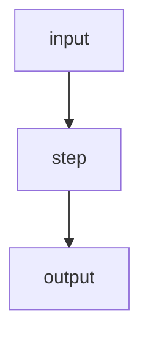

# NNNN — <Lesson title>

*<One-line subtitle: what this lesson makes you able to do.>*

**Mission:** [[MISSION]] · **Prev:** [[NNNN-prev]] · **Next:** [[NNNN-next]] · **Reference:** [[reference-name]]

---

## The question

<One paragraph. The concrete thing the learner can now answer.>

## The short answer

> [!info]
> <Two or three sentences. The takeaway in one place.>

## <Section: the mechanism, step by step>

<Tight prose, one idea per section. Tables and lists where they beat paragraphs.>

> [!warning] <Gotcha title>
> <The non-obvious failure mode, with file:line pointers.>

## A real example

![[example-plot.png]]

<Caption prose: map visual elements to the code that produces them.>

==<The single key takeaway of the lesson.>==

## Check your understanding

> [!question] <Question — no answer hints in the header.>
> Answer from memory first, then unfold to check.
>
> > [!success]- Answer
> > <Answer. Same word count across sibling quiz answers where applicable.>

---

**Primary source:** <file:line ranges or external markdown link — the highest-trust source on this topic.>

*Ask follow-up questions to your agent — anything unclear, dig in together.*
