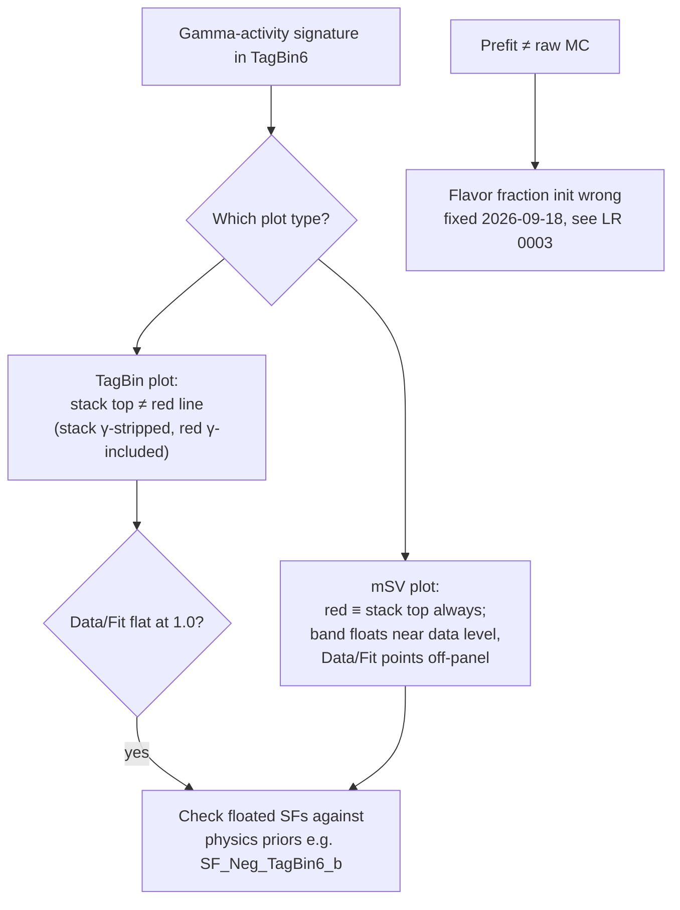

# Reference: Delta Method Map & Plot Elements

Quick lookup for the extrapolation bin wiring and DoFit plot composition. Terminology follows [[GLOSSARY]].

## Delta method wiring (SF_*_l only)

| Scheme | Fixed in fit (alpha) | Reported as | Uncertainties from |
|---|---|---|---|
| Continuous (6 q.) | `SF_Neg_TagBin6_l` = 1 | SF6 = α·SF5 = SF(70–65%) | TagBin5 (all components) |
| Continuous2D, b side | `SF_Neg_TagBin7_l` = 1 | SF7 = α·SF6 = SF(70–65%) | TagBin6 |
| Continuous2D, c side | `SF_Neg_TagBin4_l` = 1 | SF4 = β·SF3 = SF(30–10%) | TagBin3 |

Fit-side: `DoFit.cxx` NP loop (`extrapolate_SF`). Result-side: `DoResults.cxx` (CentVal + uncertainty blocks). Only the light SF; b/c SFs follow `fixBSF`/fixed-at-1 logic.

> [!warning] Open gap
> The **b SF in the tightest bin still floats** (range [0, 10], unconstrained) — the runaway seen in [[0003-stack-vs-fit-result-mismatch]]. Extending the delta method to b is a physics decision (user/FTAG).

## DoFit plot elements

The two plot types are wired differently — check which one you are reading:

| Element | mSV plot (`Plot`) | TagBin plot (`PlotTagBin`) |
|---|---|---|
| Stack l/c/b | `GetHistogram()`: shape (renormalized) × coef — gammas **stripped** | same, integrated per tag bin — gammas **stripped** (`DoFit.cxx:1632-1634`) |
| Red "Fit Result" | `GetTotal()`: sum of the *same* components — **≡ stack top, always** (`DoFit.cxx:1205`) | `GetYieldTotal()`: full-PDF integral — gammas **included** (`DoFit.cxx:1639`) |
| Grey band | `GetYieldTotalBin()`: γ-included integral + `getPropagatedError(FitRes)` (`DoFit.cxx:1135`) | never filled — **no band drawn** (`DoFit.cxx:1681`) |
| Data/Fit panel | data / **γ-stripped** total (`DoFit.cxx:1416`) → ≈0.17, off-panel in TagBin6 | data / **γ-included** red (`DoFit.cxx:1796`) → 1.0 even in TagBin6 |
| Blue dashed | `GetTotalPrefit()` (pre-fit = raw MC) | `GetTotalPrefit()->Integral()` |
| Data points | `obsData` + SumW2 errors from `ContNegTagInputs` | same |

## Diagnostic flow: where the gamma pull shows up

## Diagnostic shortcuts

- **Stack top ≠ red line** ⇒ gammas active in that category — TagBin plot only; size of gap = gamma pull. In mSV plots red always hugs the stack; the γ signature there is the band sitting near the data plus an empty Data/Fit panel.
- **Huge gap + Data/Fit flat at 1.0** ⇒ check floated SFs against physics priors (e.g. `SF_Neg_TagBin6_b`).
- **Fit status**: 0 = converged; 4 = error matrix not pos-def (can still be at the minimum); the retry loop re-fits up to 800×.
- **Prefit ≠ raw MC** ⇒ flavor fraction init wrong (see learning record 0003; fixed 2026-09-18).
- **Which gammas float**: only where the bin's relative MC stat error exceeds the threshold (`BuildWS.cxx:432`) — in this build only TagBin5/6; `FitOption = "MC_STAT"` fixes those too (`DoFit.cxx:770`).

> [!question]- Self-check: which two plot quantities differ only by gammas?
>
> > [!success]- Answer
> > The stack top (Σ coef, gammas stripped by renormalization) and the red line (gamma-included PDF integral). Identical when all γ = 1.

---
**Sources:** `DoCalibration/src/DoFit.cxx` (Plot, NP loop), `DoCalibration/src/ModelTool.cxx` (GetHistogram, GetTotal*), `DoCalibration/src/DoResults.cxx` (delta-method reporting).

Created 2026-09-18 · Converted to Obsidian Markdown 2026-09-23
